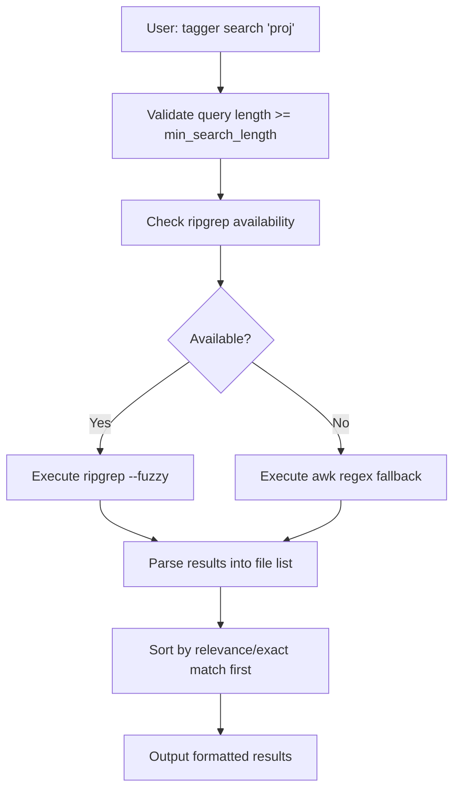
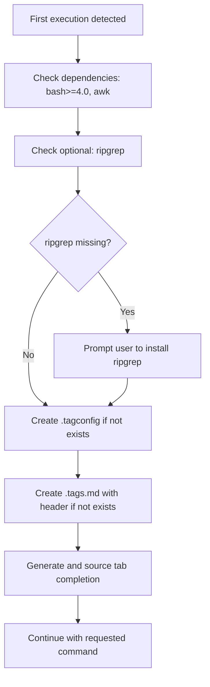

# Simplified Tagging System: Comprehensive Architectural Design Document

## 1. Introduction

This document provides a detailed architectural design for the Simplified Tagging System based on the provided requirements. The system is implemented as a single Bash script (`tagger.sh`) that manages file tags through a command-line interface. The design emphasizes simplicity, portability, and performance while meeting all functional and non-functional requirements.

## 2. System Overview

### 2.1 High-Level Architecture

The system consists of a monolithic Bash script with modular functions. Key architectural components include:

- **Command Dispatcher**: Parses CLI arguments and routes to appropriate handlers
- **Storage Manager**: Handles reading/writing to `.tags.md` with file locking
- **Tag Processor**: Manages tag operations (add, remove, validate)
- **Search Engine**: Implements fuzzy search with ripgrep/awk fallback
- **Suggestion System**: Provides dynamic tag completion
- **Setup Manager**: Handles first-run configuration and dependency checks
- **Tab Completion Generator**: Creates Bash completion scripts

### 2.2 Data Flow

1. User invokes `tagger <command> [args]`
2. Script validates dependencies and configuration
3. Command dispatcher routes to specific function
4. Function reads/parses `.tags.md` if needed
5. Operation performed (read/write to storage)
6. Results output to stdout/stderr
7. File locking ensures atomicity for writes

## 3. Data Structures

### 3.1 Persistent Storage (.tags.md)

The `.tags.md` file uses Markdown format for human readability:

```markdown
# Tags for Directory: /absolute/path/to/directory

## File: relative/path/to/file1.txt
- tag1
- tag2/subtag
- another_tag

## File: relative/path/to/file2.md
- tag1
- urgent.high
```

- **Header Section**: `# Tags for Directory: <path>` - stores absolute directory path
- **File Sections**: `## File: <relative_path>` - one per tagged file
- **Tag Lists**: Bullet points under each file section

### 3.2 In-Memory Data Structures

```bash
# Associative array: file_path -> space-separated tags
declare -A file_tags

# Associative array: tag -> space-separated file_paths  
declare -A tag_files

# Regular array: all unique tags (for suggestions/completion)
declare -a all_tags

# Configuration associative array
declare -A config
```

### 3.3 Configuration File (.tagconfig)

Optional JSON-like configuration file:

```bash
# Separator character for hierarchical tags (default: "/")
tag_separator="/"

# Maximum suggestions to show (default: 10)
max_suggestions=10

# Minimum search query length (default: 2)
min_search_length=2
```

## 4. Core Algorithms

### 4.1 Tag Validation and Normalization

```bash
function normalize_tag() {
    local tag="$1"
    # Convert to lowercase
    tag="${tag,,}"
    # Remove invalid characters (keep alphanumeric, hyphens, underscores, separator)
    tag="${tag//[^a-zA-Z0-9${config[tag_separator]}_-]/}"
    # Prevent directory traversal
    [[ "$tag" =~ \.\. ]] && return 1
    echo "$tag"
}
```

**Complexity**: O(n) where n is tag length

### 4.2 Fuzzy Search Algorithm

**Primary (ripgrep-based):**
```bash
function fuzzy_search_ripgrep() {
    local query="$1"
    rg --fuzzy "$query" --no-heading --line-number .tags.md | \
    awk -F: '{print $1}' | sort | uniq
}
```

**Fallback (awk-based):**
```bash
function fuzzy_search_awk() {
    local query="$1"
    awk -v q="$query" '
    /^## File:/ { file=$0; sub(/^## File: /, "", file) }
    /^- / { tag=$0; sub(/^-/ , "", tag); sub(/^ */, "", tag) }
    tag ~ q { print file }
    ' .tags.md | sort | uniq
}
```

**Relevance Sorting**: Exact matches first, then fuzzy matches by edit distance (implemented via ripgrep's built-in fuzzy scoring)

### 4.3 Tag Suggestion Algorithm

```bash
function get_suggestions() {
    local partial="$1"
    local max_suggestions="${config[max_suggestions]}"
    
    # Find matching tags
    local matches=()
    for tag in "${all_tags[@]}"; do
        if [[ "$tag" =~ ^"$partial" ]]; then
            matches+=("$tag")
        fi
    done
    
    # Sort alphabetically and limit
    printf '%s\n' "${matches[@]}" | sort | head -n "$max_suggestions"
}
```

**Complexity**: O(t * p) where t is total tags, p is partial length

### 4.4 File Path Update Algorithm

```bash
function update_file_paths() {
    local old_path="$1"
    local new_path="$2"
    
    # Read entire file
    local content
    content=$(< .tags.md)
    
    # Replace old path with new path in file headers
    content="${content//## File: $old_path/## File: $new_path}"
    
    # Write back atomically
    echo "$content" > .tags.md.tmp && mv .tags.md.tmp .tags.md
}
```

## 5. Workflows

### 5.1 Add Tags Workflow

```mermaid
graph TD
    A[User: tagger add file.txt tag1 tag2] --> B[Validate file exists]
    B --> C[Parse .tags.md into file_tags array]
    C --> D[Normalize and validate tags]
    D --> E[Add tags to file_tags[file.txt]]
    E --> F[Remove duplicates from tag list]
    F --> G[Write updated .tags.md with file locking]
    G --> H[Output success message]
```

### 5.2 Fuzzy Search Workflow



### 5.3 First-Run Setup Workflow



## 6. Module Breakdown

### 6.1 Main Script Structure

```bash
#!/bin/bash

# Global variables and configuration
declare -A config
declare -A file_tags
declare -A tag_files
declare -a all_tags

# Core functions
source_functions() {
    # Load all function definitions
}

# Command handlers
cmd_add() { ... }
cmd_remove() { ... }
cmd_list() { ... }
cmd_search() { ... }

# Utility functions
parse_tags_md() { ... }
write_tags_md() { ... }
validate_file_path() { ... }
lock_file() { ... }

# Main execution
main() {
    setup_environment
    parse_args "$@"
    dispatch_command
}

main "$@"
```

### 6.2 Key Functions

| Function | Purpose | Input | Output |
|----------|---------|-------|--------|
| `parse_tags_md` | Parse .tags.md into data structures | File content | Populates file_tags, tag_files, all_tags |
| `write_tags_md` | Write data structures back to .tags.md | Data structures | Updated .tags.md file |
| `normalize_tag` | Validate and normalize tag strings | Raw tag string | Normalized tag or error |
| `fuzzy_search` | Perform fuzzy search on tags | Query string | List of matching files |
| `get_suggestions` | Generate tag suggestions | Partial tag | List of suggestions |
| `setup_completion` | Generate Bash completion script | None | Completion script in ~/.tagger_completion.sh |

## 7. Error Handling and Validation

### 7.1 Validation Layers

1. **Input Validation**: Command-line argument parsing
2. **File System Validation**: Path existence, permissions, no directory traversal
3. **Data Validation**: Tag format, file integrity
4. **Dependency Validation**: Required tools availability

### 7.2 Error Codes and Messages

| Error Code | Condition | Message |
|------------|-----------|---------|
| 1 | Invalid command | "Unknown command. Use --help for usage." |
| 2 | File not found | "File does not exist: <path>" |
| 3 | Permission denied | "Permission denied accessing: <path>" |
| 4 | Dependencies missing | "Required dependency missing: <tool>" |
| 5 | Invalid tag format | "Invalid tag format: <tag>" |

### 7.3 Graceful Degradation

- Ripgrep unavailable → Fallback to awk
- File locking fails → Warn and proceed (risk of race conditions)
- Corrupted .tags.md → Attempt repair or recreate

## 8. Performance Considerations

### 8.1 Optimization Strategies

- **Lazy Loading**: Parse .tags.md only when needed
- **Incremental Updates**: Modify in-memory structures and write atomically
- **Caching**: Cache parsed data during session
- **Efficient Search**: Use ripgrep's indexing for large files

### 8.2 Benchmarks

| Operation | Target Performance | Optimization |
|-----------|-------------------|--------------|
| Parse .tags.md (1000 files, 5000 tags) | < 0.5s | Use awk for parsing |
| Fuzzy search (10000 files) | < 2s | Ripgrep with fuzzy flag |
| Add/remove tags | < 0.1s | In-memory operations |
| Startup (dependency check) | < 1s | Cache dependency status |

### 8.3 Memory Management

- Limit in-memory data structures to essential information
- Stream processing for large .tags.md files
- Clean up temporary files immediately

## 9. Security Architecture

### 9.1 Input Sanitization

- Escape shell metacharacters in file paths and tags
- Validate paths to prevent directory traversal
- Restrict tag characters to safe set

### 9.2 File Permissions

- .tags.md: 0600 (user read/write only)
- .tagconfig: 0644 (user read/write, group/other read)
- Generated completion scripts: 0644

### 9.3 Safe Execution

- Use `set -euo pipefail` for strict error handling
- Avoid `eval` or command injection
- Validate all external tool inputs

## 10. Testing Strategy

### 10.1 Unit Testing (Bats Framework)

```bash
@test "normalize_tag converts to lowercase" {
    run normalize_tag "TAG"
    [ "$output" = "tag" ]
}

@test "fuzzy_search finds approximate matches" {
    setup_test_tags
    run fuzzy_search "proj"
    [[ "$output" =~ "project.txt" ]]
}
```

### 10.2 Integration Testing

- Test full workflows: add → list → search → remove
- Test concurrent access scenarios
- Test dependency fallback behavior
- Test file system edge cases (permissions, symlinks)

### 10.3 Performance Testing

- Benchmark with varying data sizes
- Test memory usage with `valgrind` or similar
- Load testing with many files/tags

## 11. Deployment and Maintenance

### 11.1 Packaging

- Single executable script: `tagger.sh`
- Optional: Debian/RPM packages with completion installation
- Distribution via GitHub releases

### 11.2 Installation Process

```bash
# User installation
chmod +x tagger.sh
sudo mv tagger.sh /usr/local/bin/tagger

# Auto-setup on first run
tagger --help  # Triggers setup
```

### 11.3 Configuration Management

- Global config: `~/.tagger/config`
- Project config: `.tagconfig`
- Migration: Version check and upgrade logic

### 11.4 Logging and Debugging

- Verbose mode: `tagger --verbose <command>`
- Debug logging to stderr
- Error reporting with stack traces

## 12. Future Extensibility

### 12.1 Potential Enhancements

- Plugin system for custom search algorithms
- Export/import in JSON/CSV formats
- Tag statistics and analytics
- Integration with file managers (via scripts)

### 12.2 API Design

- Function-based API for external scripts
- Exit codes for scripting integration
- Structured output formats (JSON) for --json flag

This architectural design provides a solid foundation for implementing the simplified tagging system while ensuring scalability, maintainability, and adherence to the requirements. The design emphasizes Bash best practices and efficient algorithms for optimal performance.